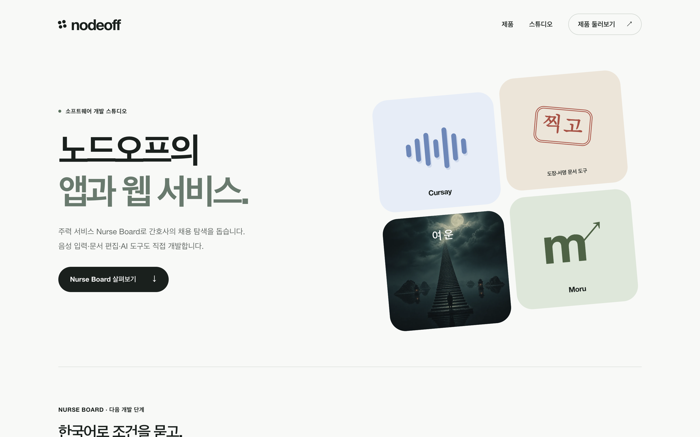

# 노드오프 홈페이지

노드오프의 서비스와 개발 중인 제품을 소개하는 회사 홈페이지.

**현재 상태:** 공개 운영 중

[서비스 열기](https://nodeoff.kr) · [소스 저장소](https://github.com/dhjin1125/nodeoff-company)

## 개발 환경에서 실행

Python 3

```sh
python3 scripts/build.py
python3 scripts/preview.py
```

로컬 미리보기는 `http://127.0.0.1:8767`입니다. `dist/`를 정적 사이트로 배포합니다.

## 운영자 정보

- 상호: 노드오프
- 대표: 진동현
- 사업자등록번호: 502-60-03676
- 운영 지역: 인천광역시
- 문의: [jin@nodeoff.kr](mailto:jin@nodeoff.kr)
- 회사 홈페이지: [nodeoff.kr](https://nodeoff.kr)

현재 개발 상태와 공개 주소는 회사 홈페이지와 함께 관리합니다.

## 공개 이력과 개발 경과

2026년 10월 7일 기존 비공개 작업을 정리해 처음 공개한 저장소입니다. 개발 시작일과 공개 커밋 날짜는 다릅니다. [개발 경과와 공개 범위](docs/development-history.md)를 확인해 주세요.

## Claude API 도입 계획

주력 서비스는 Nurse Board입니다. 현재 공개 기능은 공고 탐색·저장·지원 관리이며, Claude API는 아직 운영 연동 전입니다. 한국어 요청을 검색 조건으로 바꾸고 공고 원문에서 자격·근무 조건을 추출하는 기능을 계획하고 있습니다. 원문 근거와 없는 정보의 구분을 유지하고, 초기 사용자와 정확성·응답 시간·요청당 비용을 평가한 뒤 적용합니다. [현재 기능과 도입 계획](https://nodeoff.kr/products/nurse-board#claude-plan).

## Screenshot



Captured from the actual public website on 2026-10-07. This is a point-in-time view; sample UI illustrations on the company homepage are labeled as illustrations.
